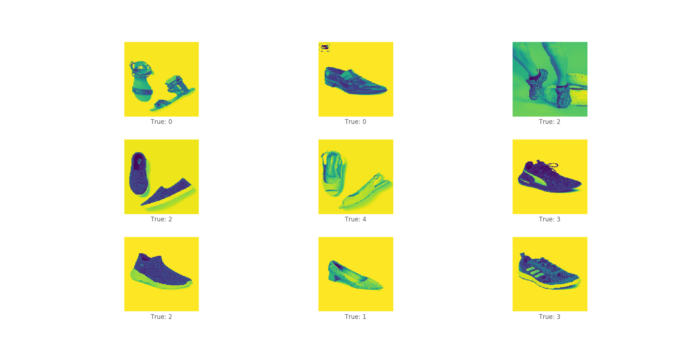
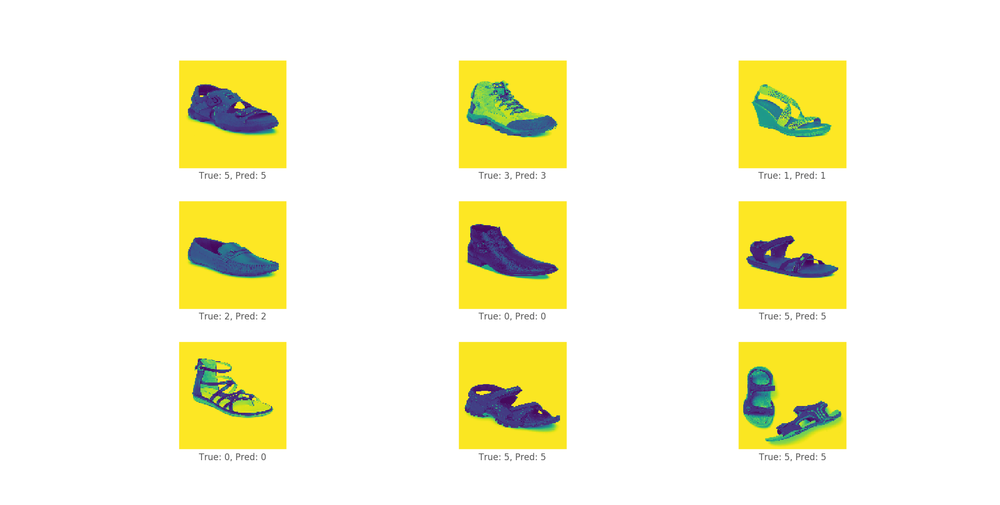
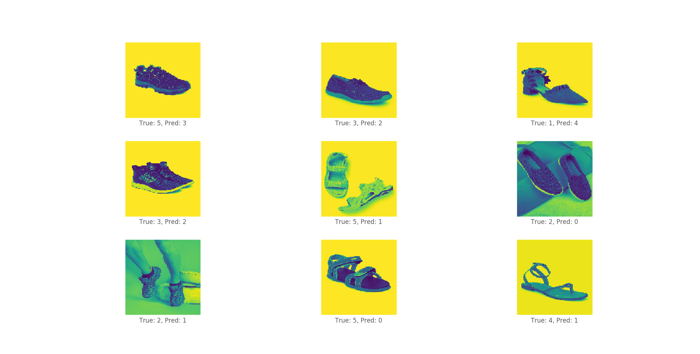
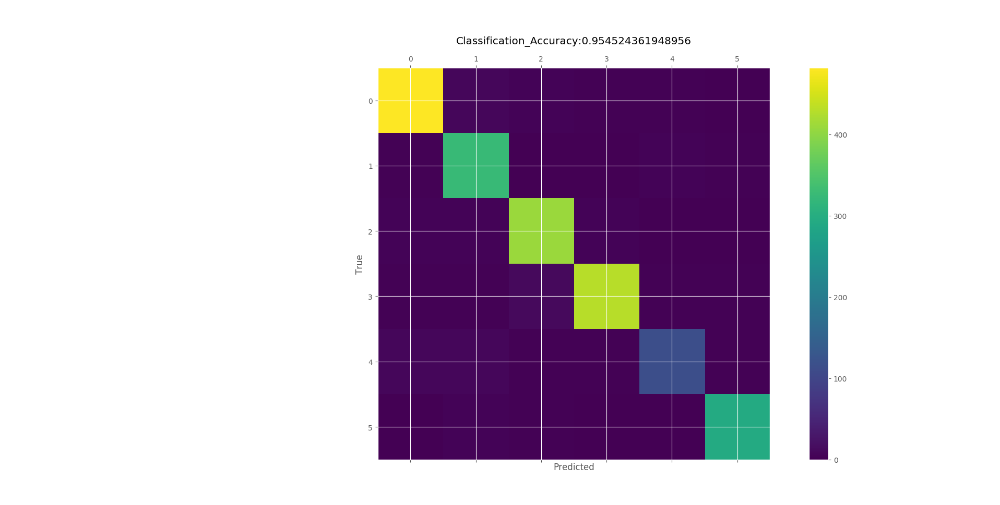

# Shoe category recognition

## Introduction 
This is a project for Fynd machine learning challenge https://blog.gofynd.com/machine-learning-internship-challenge-2019-6b4e9dddb637, a csv file is provided which contains 2000+ shoe image id and 5 different viewing angle for each shoe image.
Images from each viewing angle needs to be downloaded and stored in seperate folders respective to their viewing angle, images from each view are used to train the model and check which viewing angle provides the best results.
The dataset contains 6 unique category of shoes.

### Prerequisites
* numpy
* open-cv
* tensorflow 

### Dataset
Each view contains 2000+ shoe images with 6 unique categories.
Each image is RGB image having 1440x1080 resolution.

### Method

Images in training set are downscaled to mono-channel greyscale images having 128x128 pixels resolution.
Each unique category of shoe is assigned an integer value between 0 to 5.

***Images with true classes***

After dowloading and storing images in specific folders run the create_data.py file with location of images in the respective view folder to create training data.

    python create_data.py
    
Now numpy files for image and label data are created, run the train_data.py to train the model.

    python train_data.py

To get predictions from the trained model run predict.py 

    python predict.py
    
***Images with true and predicted classes***

***Some misclassified images***

To check which category of images are misclassified by our model plot a confusion matrix.

***Confusion matrix***

Slight colour variation is observed in true classes 3,4 model is confusing images of class 4 with class 0,1 and images of class 3 with 2.
